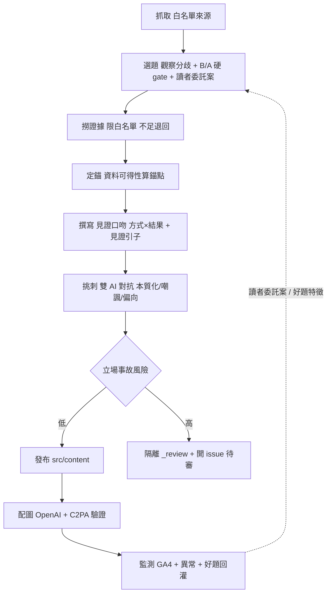

# allmoneyback.me 見證者 — 產品設計總規格

> 版本：草案 v1 ｜ 日期：2026-06-10
> 狀態：設計階段（站台與引擎機器已實作；本規格為「靈魂校準 + 互動擴充」的對齊依據）
> 本文件為「產品設計」，非「實作計畫」。實作計畫與技術細節沿用已建好的機器（見 §12）。
> 章節骨架對映自姊妹站《WitnessNoir 見證者 — 產品設計總規格》；沿用其「決定型」紀律（每節自行拍板，只有真正非本團隊能定的才進 §15）。共用機器（Astro 靜態站、單一 OKLCH CSS、雙 AI 撰寫＋挑刺、GitHub Pages 一鍵預覽/上線）為本站原創並反向供 ginny.me / patronum.guru 沿用。**內容與聲音為本站原創。**

---

## 0. 站名即咒（這站的種子，先讀這節）

**`allmoneyback.me/home`** 唸出來是 **「all money back me home」**——六字大明咒的英文諧音：

| all | money | back | me | home |
|---|---|---|---|---|
| 唵 | 嘛呢 | 叭 | 咪 | 吽 |

**唵嘛呢叭咪吽。** 首頁固定在 `/home`，是為了讓**網址本身被唸成那句咒**，而 `home／吽` 是收尾——是「回家」。

這顆種子決定了全站的靈魂：這是一個**聽著全世界為了錢、為了工作起的願與嘆息**的地方。咒是「皮」與祈願，不是要把站具象成一尊菩薩。底下的引擎，是冷靜的見證與記錄。

---

## 1. 產品定位

**一句話定義：** 一個**見證並記錄全世界各種「賺錢的活法」與它們的「結果」**的觀察站——把不同地方、不同人怎麼賺錢、最後走到什麼結局，像案卷一樣攤開、附上可查證的來源；**見證者只記錄，不下判決，把判斷留給看的人自己。**

**它不是**理財建議站、不是致富攻略、不是商業評論——而是：

> **一雙見證之眼 + 一套「記錄方式與結果、不替你評判」的自我約束**

**護城河**不是內容量、不是 SEO、不是理財資訊，而是「**這個見證的位置**」——一個不站在任何賺錢方式那一邊、只忠實攤開方式與後果、留白讓人自評的記錄姿態，加上「站名即咒」的母題。內容農場複製得了文章，複製不了這個位置與這聲嘆息。

**技術組成：** Astro 靜態站 + 單一 OKLCH CSS + 雙 AI 撰寫/挑刺管線 + GitHub Pages 一鍵預覽/上線 + Cloudflare Workers 互動後端（留言／委託投題）。純內容站，無付費牆、無金流。

> 對映 WitnessNoir §1：那是「引導式取證 + 數位存證平台，需要時付費產出法律證據包」。本站對映為「引導式**見證**＋內容存證（schema＋雙 AI＋來源），免費全開、judgment 外包給讀者」——把「證據力」從法律場景平移到「賺錢方式與結果的可查證記錄」。

---

## 2. 核心設計原則（決定型）

1. **見證優先，而非評判** — 見證者的位置是主體：觀察、記錄、攤開「賺錢方式 × 結果」。**不裁判誰的活法比較對**，judgment 留給讀者（§9 的留言與討論是判斷真正發生的地方）。
2. **「賺錢方式 × 結果」為軸** — 每篇的核心不是抽象的「文化態度差異」，而是**具體的賺錢活法 + 它走向的結局**：誰用什麼方式賺錢、付出什麼、得到什麼、失去什麼。
3. **事實無爭議（B 類題）** — 只記錄事實本身無爭議、只是「方式與結果因處境而不同」的題；數據真偽、科學未定論、政治勝負題一律不進生產（沿用既有 B/A 硬 code gate）。
4. **記錄者克制，咒為皮非角色** — 聲音帶一絲「聽世間錢之苦」的悲憫（咒的精神），但**不具象成單一人物**（不是觀世音、不是 Ginny 那種有名字身世的敘事者）。是一雙**集體的見證之眼**——以「我們見證到…」的克制收束，不抒情成一個角色的自傳。
5. **誠實分層** — 文內維持見證口吻；meta／disclosure 層**據實標示由 AI 撰寫並由 AI 互審**（`writeModel`／`critiqueModel`／AiDisclosure 元件）。人設是位置，不是對 AI 本質的欺瞞。
6. **讀者自評 + 委託投題** — 讀者不只是看：他們在留言處**自己評判、彼此辯**，也能**帶一樁賺錢的事來委託**見證者去查、去記（§9）。投題回灌選題引擎，形成「讀者出案 → 見證者調查記錄 → 讀者再評」的循環。
7. **視覺克制** — 字級鎖死在 design-tokens 量表（最小 18px）、全站單一 CSS 設定檔、顏色一律 OKLCH（含 hex fallback），為長文閱讀與列印最佳化。
8. **漸進上線** — 買網址前先在 `github.io` 看草稿（webroot base path），買網址後改一個 repo 變數 `DEPLOY_TARGET=production` 即正式上線。

---

## 3. 核心名詞與資料模型

| 名詞 | 定義 |
|------|------|
| **見證記錄（Article）** | 一篇對「某種賺錢方式 × 其結果」的跨文化見證散文。Markdown 一檔一篇，slug = 檔名。frontmatter 為主鍵。 |
| **賺錢方式（method）** | 本篇見證的核心活法（如：靠加班換收入、靠負債撬槓桿、靠儲蓄等退休、靠副業/零工、靠資產增值…）。 |
| **結果（outcome）** | 該方式走向的結局/後果（安全感、過勞、財富、債務、自由、空洞…）。**本站新增、必填欄位**——沒有「結果」就只是態度比較，不是見證。 |
| **錨文化（anchorCulture）** | 由資料可得性算出的基準文化（沿用既有 anchor 演算法：哪個文化在這題上資料最穩、最一手、最可信）。 |
| **對比（comparedCultures）** | 2–4 個有可信資料的對照文化；資料黑箱者標「存疑對照」。 |
| **見證引子（witnessVigil）** | 本站新增的濃度欄位：一段見證者站在這樁賺錢方式前的開場見證引文（對映正文開頭，承載「咒為皮」的克制悲憫）。對映 ginny 的 `ginnyMemory`、patronum 的 `patronumVigil`。 |
| **來源（sources[]）** | 以可查證連結支撐「方式」與「結果」的描述（限白名單、不杜撰）。 |
| **委託案（Commission）** | 讀者投來的新主題（「我見過一種賺錢的活法…」）。落進互動後端，並回灌選題引擎當候選案件。 |
| **留言（Comment）** | 讀者在某篇見證記錄下的評判與討論。「讓人們自己評判」在此發生。 |

**每篇硬性條件：** `factCategory = B`、含 1 `anchorCulture` ＋ 2–4 `comparedCultures`、含 `method`、含 `outcome`、含 `witnessVigil`、`sources[]` ≥ 1。不符 → schema 驗證拒絕，擋下建置。

> 對映 WitnessNoir §5「證據單元」：那裡一張照片的可信來自雙雜湊 + 雜湊鏈綁死原件/展示版/情境；**這裡一篇見證記錄的可信來自 schema 約束 ＋ 雙 AI 挑刺 ＋ 可查證來源 ＋ 誠實揭露 ＋「記錄方式與結果、不下判決」鐵律。**

---

## 4. 主線流程（見證產製管線，已實作）



> 引擎已建好（見 §12）。本規格對它的唯一「靈魂層」修改：撰寫/挑刺 prompt 的人稱與軸（見證口吻、方式×結果、見證引子），以及選題引擎吃「讀者委託案」。

---

## 5. 見證者（身分與聲音）

- **不是一個人物。** 是一雙**集體的見證之眼**——「我們見證到…」「我們把它記下來」。沒有名字、沒有身世、不自述上傳或前世。
- **聲音濃度 = 中。** 克制、冷靜、像案卷；但每篇以 `witnessVigil` 開場時，准許一絲「聽世間為錢起願與嘆息」的悲憫（咒的精神）。**克制是主、悲憫是底色，不可喧賓奪主成抒情散文。**
- **咒的精神（皮，非角色）：** 全站母題是「all money back me home／唵嘛呢叭咪吽」——對全世界賺錢之苦的旁聽與「願你回得了家」的祈願。出現在首頁、`witnessVigil`、頁尾，但**從不把見證者寫成一尊菩薩或任何擬人神格**。
- **誠實分層（已定）：**
  - **文內層**：維持見證口吻（「我們見證／記錄」）。
  - **meta／disclosure 層**：據實標示內容由 AI 撰寫並由 AI 互審（`writeModel`/`critiqueModel`/AiDisclosure/JSON-LD）。
- ⚠ **限制（已知並接受）：** 「見證之眼」是文學位置；本站從不在 meta 層假裝它是真人或神。讀者要查，disclosure 頁據實可查。

> 對映 ginny §8（Ginny，濃、單一人物）與 patronum §3（Patronum，濃、單一守望者）：**本站刻意相反——不具象成單一人物，是集體見證、中濃度、咒為皮。** 三站同骨架、不同魂。

---

## 6. 網站畫面與頁面

- **`/home`（首頁，固定路徑）** — 網址即咒。hero 點出「all money back me home＝唵嘛呢叭咪吽」與見證位置；不評判、邀請讀者自評與投題。
- **見證記錄列表 / 單篇** — 方式×結果為主視覺；分歧以並列/表格呈現（服務 AEO）；篇末 `sources` + AiDisclosure 生成揭露。
- **委託投題頁** — 「帶一樁賺錢的事來」表單（§9）。
- **關於 / 揭露 / 編輯政策 / 隱私 / 條款 / 聯絡** — 政策頁；誠實分層在揭露頁說清楚。
- **搜尋（pagefind）**、**RSS / llms.txt / llms-full.txt**。
- 雙語結構（`/zh/`、`/en/` + hreflang）先架好，起步只發繁中（en hreflang 暫關）。

> `/home` 與既有 `/zh/` 的關係：`/home` 為品牌正門（咒），其下內容仍走 `/zh/` 語言結構；`/`→`/home`→`/zh/` 的入口層級於實作計畫定案。

---

## 7. 永續與定位（對映 WitnessNoir §7「封存付費 IAP」）

WitnessNoir 在此節是「付費封存 IAP（外部時戳錨定）」。**本站無付費牆、無金流、無 IAP**——它是內容站，不是交易產品。對映：

- **價值來源** = 見證位置與選題紀律，而非付費功能。
- **永續** = 低維運（純靜態 + GitHub Pages 免費）＋ 可持續的內容產製管線 ＋ Cloudflare 免費級互動後端。
- **未來若商業化**（列未來，非 MVP）：電子報、贊助、選集——但都不得犧牲 §2 的見證位置與鐵律。

---

## 8. 身分與誠實（對映 WitnessNoir §8 身分 / §11 法律）

- **內容誠實分層**：文內見證口吻；meta 層據實標 AI（§5）。
- **互動身分（§9 配套）**：免登入留言/投題（B 案）→ 以暱稱 + 後端側辨識（IP/裝置指紋雜湊，僅供防濫用，不對外、不剖繪）。不蒐集真實姓名。
- **倫理紅線（本站的踩雷不是法律是倫理，沿用 patronum §8 精神）**：禁止把某文化的賺錢方式本質化、嘲諷、或暗示某群體「就是這樣賺錢」；方式與結果一律歸因於處境/制度/歷史，不歸因於民族性。挑刺 AI 專責守這條。

---

## 9. 互動與社群（對映 WitnessNoir §9「驗證網站」／ ginny §9「探索與互動」）

WitnessNoir §9 是給第三方驗證證據的網站。本站對映為「**讓人們自己評判、並把案子帶來給見證者**」——這是本站相對 ginny/patronum 的**新增主軸**。

### 9.1 留言（讓人們自己評判）
- 每篇見證記錄下方可留言、可回覆。**見證者不參與裁判**；留言是讀者彼此評判、辯論之處，呼應 §2「judgment 留給讀者」。
- 顯示克制（無讚數煽動、無演算法排序戰），時間序為主。

### 9.2 委託投題（帶一樁賺錢的事來）
- 表單：讀者描述「我見過/想知道的一種賺錢方式與它的結果」，可附地區/來源線索。
- 送出 → 進互動後端佇列 → **回灌選題引擎**當「讀者委託的候選案件」（與既有 fetch/選題並列為選題來源；仍須過 B/A gate、定錨、撈證據才會被見證者立案）。
- 形成循環：**讀者出案 → 見證者調查記錄 → 讀者在留言再評 → 好題回灌**。

### 9.3 技術選型（已定：B 案 — 自有後端、免登入）
- **Cloudflare Workers + D1（留言/委託案）+ KV（速率限制/快取）**。前端靜態頁以 fetch 打 Worker API。
- **免 GitHub/第三方登入**：暱稱即可發言/投題；身分以後端側 IP/裝置指紋雜湊辨識（防濫用用途，不外露）。
- **防濫用（必做）**：速率限制（KV）、最小化欄位、伺服器側內容過濾、可選人工/AI 預審佇列（高風險留言/投題進待審，不裸奔）。
- **與站台解耦**：Worker 為獨立部署（`workers/`），靜態站照常 GitHub Pages；CORS 鎖本站網域。
- 未來可加：委託案的公開狀態頁（已立案/調查中/已見證）、訂閱「我投的案被見證了」通知。

> 對映 WitnessNoir「金流即旁證」：那裡 IAP 收據是第三方背書；這裡**讀者的公開留言與委託案是『社群在場』的旁證**——見證不再只是單向輸出，而是有人帶案子來、有人在底下評判。

---

## 10. 內容輸出格式（對映 WitnessNoir §10「證據包 zip/pdf」）

WitnessNoir 輸出證據包。本站對映為見證記錄的多種輸出：

- **HTML** — 靜態頁，主要閱讀介面。
- **OG 圖** — build-time satori（SVG → PNG via sharp）per-article 動態生圖；AI 圖標記。
- **配圖** — OpenAI Image，保留出廠 C2PA Content Credentials，build 時逐張驗證憑證（缺即 build 失敗）。
- **RSS / llms.txt / llms-full.txt** — 供訂閱者與 LLM 取用。

---

## 11. 寫作倫理與風險（對映 WitnessNoir §11「防竄改與法律」）

- **立場事故風險分流**：挑刺 AI 對抗式檢查本質化/嘲諷/偏向；低風險發布、高風險隔離 `_review/` + 開 issue 待審（站長偶爾看，不逐篇）。
- **記錄而非教唆**：見證「賺錢方式與結果」時，呈現後果（含代價/風險/違法者標明法律與倫理界線），**不寫成致富攻略、不美化高風險或不法活法**。
- **B 類鐵律**：事實有爭議的題不進生產（A 類 gate）。
- **正式揭露用詞**：見證記錄、賺錢方式、結果、來源、生成資訊（撰寫模型/校核模型/生成日期/pipeline 版本）、見證引子。

---

## 12. 系統架構（機器已實作，本節為現況存照）

```mermaid
flowchart TD
    subgraph 內容機器 已建
      ENG[engine/ 半無人 pipeline<br/>抓取→選題→撈證據→定錨→撰寫→挑刺→分流→配圖→監測]
      ENG --> MD[(src/content/articles<br/>見證記錄 Markdown)]
    end
    subgraph 站台 Astro 靜態
      MD --> SITE[Astro build<br/>OG/JSON-LD/AEO/pagefind/雙語]
      SITE --> PAGES[GitHub Pages<br/>DEPLOY_TARGET preview/production 一鍵切換]
    end
    subgraph 互動 新增 §9
      WK[Cloudflare Worker + D1/KV<br/>留言 / 委託投題]
    end
    PAGES <-->|fetch API| WK
    WK -.讀者委託案.-> ENG
    GA[GA4 + 異常 + 好題回饋] -.-> ENG
```

**沿用既有技術選型（已實作 2026-06）：** Astro 5 靜態、單一 OKLCH design-tokens CSS、`@anthropic-ai/sdk`（claude-opus-4-8、adaptive thinking、雙 AI）、satori OG、sharp + C2PA 驗證、GA4 Data API、`DEPLOY_TARGET` 一鍵切換。**新增：** Cloudflare Workers + D1/KV 互動後端。

---

## 13. 對齊範圍（從本規格要落地的事）

> 本節是「靈魂校準 + 互動擴充」要動的清單；細節進實作計畫。

1. **首頁搬到 `/home`** —— 網址即咒；hero 改見證位置與咒母題。
2. **前台文案全面改為見證口吻** —— 首頁/about/政策頁去除「AI 觀察者」泛稱與旁觀腔，改集體見證之眼、咒為皮、不評判=記錄者克制。
3. **content schema 加欄位** —— `method`、`outcome`（必填）、`witnessVigil`（見證引子）。
4. **引擎 prompt 對齊** —— 撰寫 AI：見證口吻 + 方式×結果 + 見證引子；挑刺 AI：守倫理紅線（§8）。
5. **AGENTS.md 寫作鐵律** —— 改為見證者集體口吻、方式×結果軸、咒為皮、誠實分層、不本質化。
6. **誠實分層** —— 文內見證 / meta 標 AI，落實到 AiDisclosure 與 JSON-LD。
7. **互動後端（§9，B 案）** —— `workers/` 下 Cloudflare Worker + D1/KV；留言 + 委託投題；投題接選題引擎；防濫用。
8. **示範見證記錄** —— 重寫一篇走完整新軸（方式×結果×見證引子）的示範文。

---

## 14. 未來擴充

- 委託案公開狀態頁（已立案/調查中/已見證）+ 「我的案被見證了」通知。
- 留言的輕量 AI 摘要（把長討論收斂成「讀者怎麼評判的」一段，仍不替讀者下結論）。
- 英文版上線（雙語架構已備；屆時挑刺 AI 對每語言各跑一次）。
- 選集/電子報（不得犧牲 §2 鐵律）。

---

## 15. 待確認（TBD，真正非本團隊能定者）

- 見證者集體口吻的**最終濃度**（克制↔悲憫的比例）——需站長對首篇示範文拍板。
- `/home` 與 `/zh/` 的入口層級最終結構（重導 vs 正門即內容）。
- Cloudflare 帳號/網域綁定、D1 資料表 schema 細節、防濫用閾值、是否要委託案/留言的 AI 預審。
- 互動後端的隱私揭露文案（免登入但仍記 IP 雜湊）→ 隱私頁據實寫。
- 站名母題（咒）對外呈現的分寸——避免冒犯宗教，定調為「諧音致敬 + 對賺錢之苦的旁聽」，非宗教宣稱。

---

## 附：來源對應
- 規範骨架：《WitnessNoir 見證者 — 產品設計總規格》§1〜§15（`~/Downloads/`）。
- 姊妹站對映參考：`weiqi.kids/ginny.me/docs/ginny.me-總規格.md`、`weiqi.kids/patronum.guru/docs/patronum.guru-總規格.md`。
- 共用機器與既有實作：本 repo `docs/superpowers/specs/`、`docs/superpowers/plans/`、`engine/`、`astro.config.mjs`、`.github/workflows/`。
- 視覺 token：`~/.claude/skills/design-tokens`（字級量表、OKLCH 色票）。
